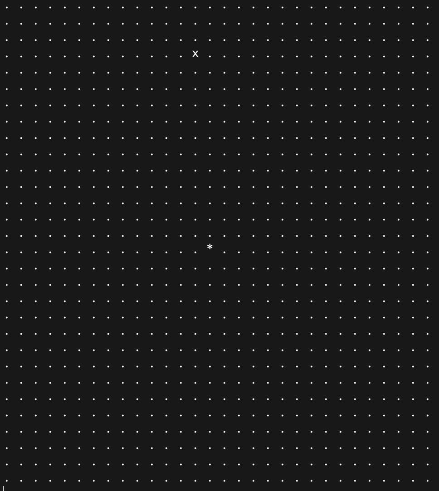
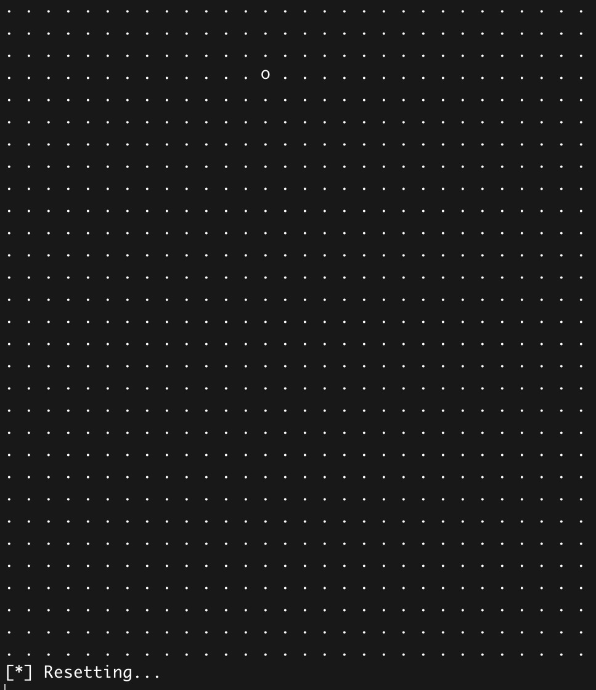

# RobotSimulation
### 2D engine robot simulator

#### Design
* Engine
> 2D matrix in a 1D array with border and position checking and two points A and B where the robot should start and finish respectively asserted randomly in each hemisphere 
*  Robot
> Robot simulator with wheels that moves [up, down], slowly turning [right, left] (possible while moving), with direction switching with [start/stop] on [spacebar] with negative acceleration to stop, acceleration, speed [0-x] and distance sensoring for acceleration management

#### Configuration
> Edit "configs.go" to configure your own robot, world size and graphics

#### Startup
> go mod init github.com/trevalkov/RobotSimulation
> go mod tidy
> go run .

</img>
</img>
